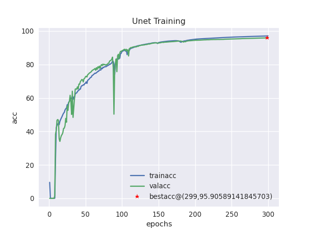
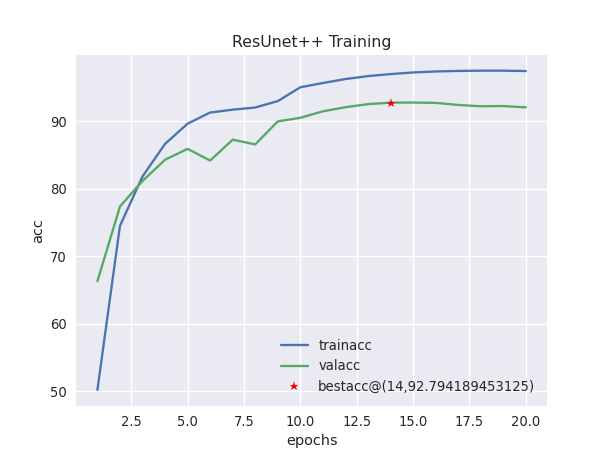
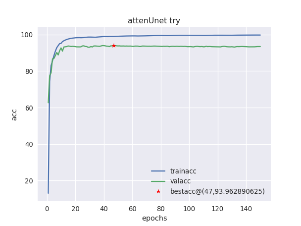

# Checkerboard Segmentation

This module concerns the training of deep learning models using the [checkerboard dataset](../CheckerBoard-Dataset). 

## Usage

### main.py

Run `main.py` to train a segmentation model on the checkerboard dataset.

```bash
python main.py -n <experiment_name> -e <number_of_epochs> -a <path/to/checkerboard/dataset/> -m <model_id>
```

- `-m` : segmentation model to be used *(model_id : model_name)* :
  1. Unet
  2. ResUnet++ 
  3. Attention Unet.


### **About The Trained Model**:
The model was trained on `COCO` dataset. The annotations were used to paste the pattern on the objects in the images. Nearly 30000 images were obtained and splitted into `Train`, `Validation` and `Test` set in 70:20:10 ratio.

The graphs obtained by the models are:

<p align="center" width="100%">
         
     
    
</p>

The accuracy obtained on the test set for the three models above was 96%, 92.92%, 93.96% respectively.

The parameters obtained from training the above three models are saved in .pth files which can be loaded in a model and can be used to generate the outputs or train the model even further.