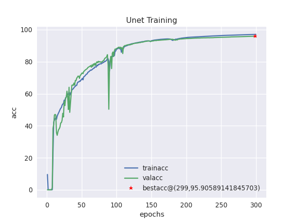
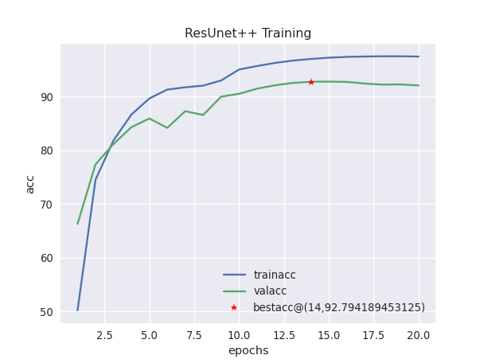
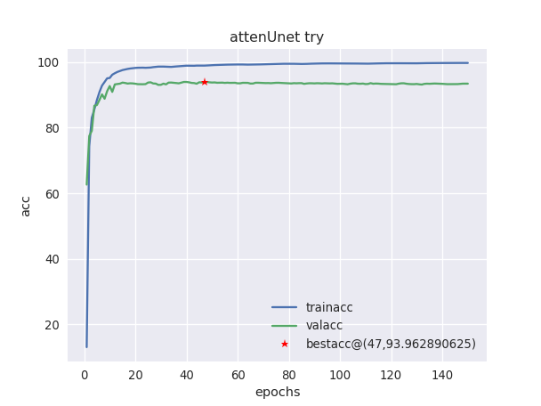

# **_Human Pose Estimation_**

## Checkerboard Pattern

*insert some pattern here*

## Checkerboard Dataset

*insert some best samples from the dataset*

## Checkerboard Segmentation

*insert best predictions (with ground truth) here*

## Requirements

- Python 3.6.10
- PyTorch version 1.6.0
- CUDA version 10.1
- 2 NVIDIA® Tesla® V100(16 GB Memory) GPUs.

## Usage

Image Segmentation is performed on the images where is object which is to be detected is covered by a pattern in all the images.

The model used for training the model is UNet. Multiple models were tried like ResUnet++, Attention Unet and the best results were given by UNet model.

1. ) CheckerBoard.py : 
    * This file has the code for loading the dataset.
    * The class `GridDataset` can be initialized by passing the address of the dataset and type of data you need to load.
    * It splits the data in train, val and test set in the ratio of 70:20:10.
    * After splitting the data, it saves the data as `.npy` files which can be loaded much faster next time the code runs.

2. ) Unet.py :
    * This script contains the model.
    * The model can be initialized by passing in the `in_channels`, `n_classes`, `depth`, `wf`, `padding`, `batch_norm`, `up_mode`. All these arguments are defaulted to the values of `3, 1, 5, 6, True, False, up_conv` respectively.

3. ) main.py :
    * The main script of the code. To run this file, some flags need to be passed which are:
        * `-n` : Name of the project
        * `-e` : Number of epochs
        * `-a` : Address of the folder which contains the Data.
        * `-m` : The model you want to use to train. 1 for Unet, 2 for ResUnet++ and 3 for Attention Unet.

4. ) DataAugmentation.py :
    * The script applies brightness change, contrast change and saturation change on the pattern images.

5. ) image_zoomOut.py :
    * The patterns that are obtained after augmentation are placed in a 2 x 2 matrix and the same pattern is pasted at each index. 
    * Then the resulting image is resized to the same size as that of the original pattern.

6. ) ds1.py:
    * This script pastes the patterns on the raw images of `COCO` dataset.
    * To run this script,
      
            python3 ds1.py -a /path/to/Pattern/folder/ 

----
### **About The Trained Model**:
The model was trained on `COCO` dataset. The annotations were used to paste the pattern on the objects in the images. Nearly 30000 images were obtained and splitted into `Train`, `Validation` and `Test` set in 70:20:10 ratio.

The graphs obtained by the models are:

         
     
    

The accuracy obtained on the test set for the three models above was 96%, 92.92%, 93.96% respectively.

The parameters obtained from training the above three models are saved in .pth files which can be loaded in a model and can be used to generate the outputs or train the model even further.