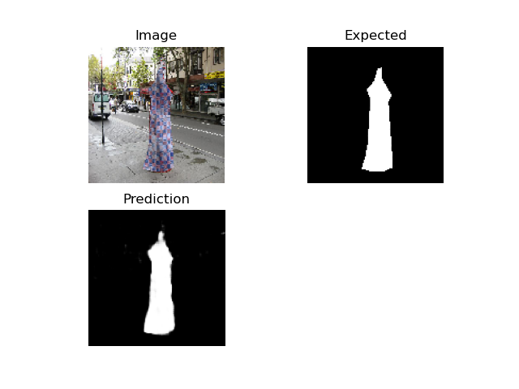
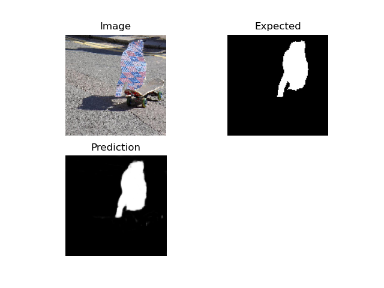
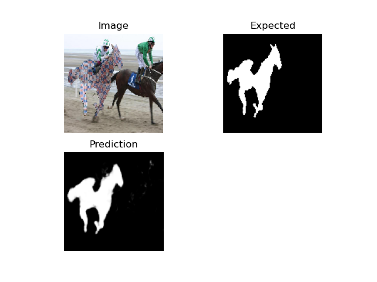

# **_Human Pose Estimation_**

## *Checkerboard Pattern*

         
    
    

---

## *Checkerboard Dataset*

 1. ) Images

         
    
    

 2. ) Labels

         
    
    

---
## Checkerboard Segmentation

    
    
    

## Requirements

- Python 3.6.10
- PyTorch version 1.6.0
- CUDA version 10.1
- 2 NVIDIA® Tesla® V100(16 GB Memory) GPUs.

## References

1. ) Unet Paper: https://arxiv.org/pdf/1505.04597v1.pdf

2. ) Attention UNet Paper: https://arxiv.org/pdf/1804.03999v3.pdf

3. ) Attention Unet Implementation: https://github.com/bigmb/Unet-Segmentation-Pytorch-Nest-of-Unets

4. ) ResUnet++ Paper: https://arxiv.org/pdf/1911.07067v1.pdf

5. ) ResUnet++ Implementation: https://github.com/rishikksh20/ResUnet