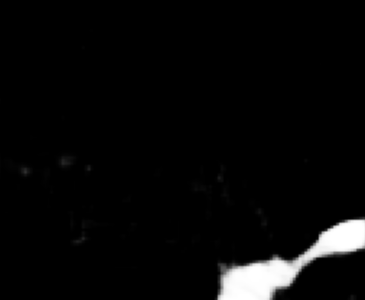

# **Human Pose Estimation**

In this work we aim to track body motions in real time using novel dress (called MOCAP suit) and deep learning models. Here we briefly mention about how to create the MOCAP suit, how the training dataset is created, and the results obtained using U-Net. **[Report](./Report.pdf)** includes the exact details of the work.

## [Checkerboard Pattern](./Checkerboard-pattern/arucopp.py)

The MOCAP suit is made from the checkerboard pattern. This a pattern created specifically for real-time detection of human joints (points).

         
    
    

## [Checkerboard Dataset](./Checkerboard-Dataset/)

The dataset to train DL models is created with the help of Coco API. We generate around 30,000 samples with good quality checkerboard pattern placed over various class categories like humans, vehicles, animals, etc.

**Images**

         
    
    
         
    
    

**Labels**

         
    
    
         
    
    

## [Checkerboard Segmentation](./Checkerboard-segmentation)

Different SoTA segmentation models are benchmarked over this dataset. Some predictions of U-Net are shown below. U-Net gives a dice score of **96.7%**.

**Images**

    
    
    
    
    
    

**Labels**

    
    
    
    
    
    

**Predictions**

    
    
    
    
    
    

## Requirements

- Python 3.6.10
- PyTorch version 1.6.0
- CUDA version 10.1
- 2 NVIDIA® Tesla® V100(16 GB Memory) GPUs.

